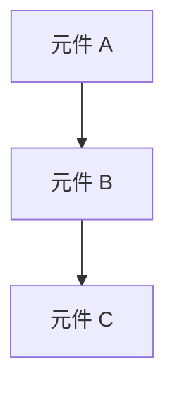

# [元件/功能名稱] — 技術規格文件

**Spec ID：** [SPEC-YYYYMMDD-001]
**關聯 PRD / Epic：** [Epic ID 或 N/A]
**ADO Epic：** [連結或 N/A]
**狀態：** 草稿（Draft）
**作者：** [姓名 (email)]
**Tech Lead：** TBD
**建立日期：** [YYYY-MM-DD]
**更新日期：** [YYYY-MM-DD]

---

## Executive Summary

> **給 Technical Manager 和 Product Owner 的摘要（建議 5–8 行以內）**

[一段話說明這份 Spec 要解決什麼問題、採用什麼技術方向、主要影響範圍，以及預計上線時程。]

| 項目 | 說明 |
|------|------|
| **解決問題** | [一句話] |
| **技術方向** | [例如：擴展 Databricks External Model 設定，無需修改 Lambda 程式碼] |
| **影響範圍** | [例如：DynamoDB 權限表、CloudWatch Logs、Databricks 設定] |
| **主要依賴** | [例如：資安審查、OpenAI 企業帳號] |
| **預計上線** | [YYYY-MM] |

---

## 背景與目標

### 背景

[說明為什麼需要這份 Spec，與 PRD 的關係，以及目前系統的相關狀態。若有關聯 PRD，請引用。]

> **關聯 PRD：** [PRD 標題 + 檔案路徑或連結]

### 目標

[此 Spec 要達成的技術目標，與 PRD 目標對應]

### 非目標

[明確排除在本 Spec 範圍外的技術項目]

---

## 系統架構

> **注意：** 架構圖為必填欄位。請使用 Mermaid 繪製，確保跨團隊工程師能快速理解整體設計。

### 架構概覽圖



> 請依實際架構替換上方圖示。建議使用 `sequenceDiagram`（請求流程）或 `graph TD`（元件關係）。

### 元件說明

| 元件 | 角色 | 現有 / 新建 | 備註 |
|------|------|------------|------|
| [元件名稱] | [說明] | 現有 / 新建 | [備註] |

---

## 詳細設計

### 元件設計

[說明每個核心元件的職責、輸入輸出、與其他元件的互動方式]

#### [元件名稱]

- **職責：** [說明]
- **觸發條件：** [例如：HTTP 請求 / Event / 排程]
- **輸入：** [說明]
- **輸出：** [說明]
- **依賴：** [列出依賴的元件或服務]

---

### API / Interface 規格

> 適用於有對外或跨元件 API 的情境。若無，標記 N/A。

#### `[HTTP Method] [路徑]`

**Request**

```json
{
  "field_name": "string",
  "field_name2": 0
}
```

| 欄位 | 類型 | 必填 | 說明 |
|------|------|------|------|
| `field_name` | string | 是 | [說明] |

**Response（200 OK）**

```json
{
  "field_name": "string"
}
```

**Error Codes**

| HTTP 狀態碼 | 情境 | 回傳訊息 |
|------------|------|---------|
| 400 | [情境] | [訊息] |
| 401 | 未授權 | `Unauthorized` |
| 403 | 無存取權限 | `Forbidden` |
| 500 | 內部錯誤 | `Internal server error` |

---

### 資料模型 / Schema

> 說明新增或修改的資料結構。若無變更，標記 N/A。

#### [Table / Collection 名稱]

| 欄位 | 類型 | 說明 | 範例值 |
|------|------|------|--------|
| `field_name` | String | [說明] | `example` |

---

## 基礎設施與部署

### AWS 資源清單

| 資源類型 | 名稱 / ARN | 現有 / 新建 | 說明 |
|---------|-----------|------------|------|
| Lambda | [名稱] | 現有 | [說明] |
| DynamoDB | [名稱] | 現有 | [說明] |
| [其他] | [名稱] | 新建 | [說明] |

### IaC 設計（Terraform）

[說明哪些資源透過 Terraform 管理、新增哪些 module 或 resource，以及任何需要注意的 Terraform 設計決策]

### 環境規劃

| 環境 | 說明 | 特殊設定 |
|------|------|---------|
| dev | 開發測試 | [說明] |
| staging | 整合測試 | [說明] |
| prod | 正式環境 | [說明] |

---

## 注意事項（Considerations）

> **說明：** 以下分為**必填項目**（每份 Spec 均須填寫）及**選填項目**（不適用時請填 N/A 並說明原因）。

---

### ✅ 必填項目

#### 1. Scalability（可擴展性）

[說明系統如何應對流量成長。例如：Auto-scaling 設定、Lambda 並發限制、DynamoDB capacity mode 等]

| 面向 | 設計說明 |
|------|---------|
| 水平擴展 | [說明] |
| 流量上限 | [說明] |
| 瓶頸識別 | [說明] |

---

#### 2. Reliability / Availability（可靠性）

[說明 SLA 目標、SPOF 識別、Failover 機制]

| 指標 | 目標值 | 說明 |
|------|--------|------|
| 可用性目標 | [例如 99.5%] | [說明] |
| SPOF 識別 | [列出] | [緩解措施] |
| Failover 機制 | [說明] | [說明] |

---

#### 3. Security（資安）

[說明 AuthN/AuthZ 設計、加密方式、網路隔離、憑證管理]

| 面向 | 設計說明 |
|------|---------|
| 身份驗證 | [說明] |
| 授權控管 | [說明] |
| 傳輸加密 | [例如：TLS 1.2+] |
| 靜態加密 | [說明] |
| 憑證管理 | [例如：Secrets Manager / Databricks Secret Scope] |
| 網路隔離 | [例如：VPC / Security Group 設定] |

---

#### 4. Observability（可觀測性）

[說明 Logging、Metrics、Tracing、Alerting 設計]

| 面向 | 工具 | 說明 |
|------|------|------|
| Logging | CloudWatch Logs | [記錄哪些欄位、保留期限] |
| Metrics | CloudWatch Metrics | [監控哪些指標] |
| Tracing | AWS X-Ray / [其他] | [說明] |
| Alerting | CloudWatch Alarms | [觸發條件、通知對象] |

---

### 🔲 選填項目

> 不適用時請填寫 **N/A** 並簡述原因。

---

#### 5. Disaster Recovery（災難復原）

**適用：** [是 / N/A — 原因：]

| 指標 | 目標值 | 說明 |
|------|--------|------|
| RTO（Recovery Time Objective） | [說明] | 系統恢復服務的最大可接受時間 |
| RPO（Recovery Point Objective） | [說明] | 資料回復的最大可接受時間點 |
| 備份策略 | [說明] | [說明] |
| DR 模式 | [Backup / Pilot Light / Warm Standby / Multi-site] | [說明] |

---

#### 6. Cost（成本）

**適用：** [是 / N/A — 原因：]

| 資源 | 估算費用 / 月 | 說明 |
|------|-------------|------|
| [資源名稱] | [金額] | [說明] |

> **成本優化策略：** [說明]

---

#### 7. Testability（可測試性）

**適用：** [是 / N/A — 原因：]

| 測試類型 | 工具 | 覆蓋範圍 | 負責人 |
|---------|------|---------|--------|
| 單元測試 | [工具] | [說明] | [說明] |
| 整合測試 | [工具] | [說明] | [說明] |
| 負載測試 | [工具] | [說明] | [說明] |
| 資安測試 | [工具] | [說明] | [說明] |

---

#### 8. Maintainability（可維護性）

**適用：** [是 / N/A — 原因：]

[說明程式碼結構、文件標準、技術債識別、模組化設計原則]

---

#### 9. Compliance / Governance（合規）

**適用：** [是 / N/A — 原因：]

[說明法規要求、稽核追蹤機制、資料保留政策、與資安團隊的對齊方式]

---

#### 10. Migration / Backward Compatibility（遷移）

**適用：** [是 / N/A — 原因：]

[說明遷移策略、版本相容性設計、廢止舊有機制的時程]

---

## 測試策略

[說明上線前的測試計畫，包含測試環境、測試案例重點、驗收標準]

### 測試案例重點

| 測試案例 | 預期結果 | 優先級 |
|---------|---------|--------|
| [說明] | [說明] | P1 / P2 |

### 驗收標準

- [ ] [條件 1]
- [ ] [條件 2]

---

## 上線計畫

### 上線步驟

1. [步驟 1]
2. [步驟 2]
3. [步驟 3]

### Rollback 計畫

[若上線後發生問題，如何快速回滾？步驟為何？]

### 上線後驗證

[上線後需確認哪些指標或功能正常？]

---

## 開放問題

| 問題 | 負責人 | 截止日期 | 狀態 |
|------|--------|----------|------|
| [問題說明] | [負責人] | TBD | 開放 |

---

## 核准紀錄

| 角色 | 姓名 | 狀態 | 日期 |
|------|------|------|------|
| Tech Lead | TBD | 待核准 | — |
| Technical Manager | TBD | 待核准 | — |
| 資安負責人 | TBD | 待核准 | — |

**Spec 狀態：** 草稿（Draft）

---

## 版本歷程

| 版本 | 日期 | 作者 | 變更說明 |
|------|------|------|----------|
| 0.1.0 | [YYYY-MM-DD] | [作者] | 初始草稿 |

---

## 附錄

### A. 業界最佳實踐參考

> AI 生成：以下連結來自對本 Spec 相關領域業界標準與最佳實踐的搜尋結果。對外分享前請先驗證連結有效性。

| 面向 | 來源 | 連結 | 關聯性 |
|------|------|------|--------|
| **Scalability** | AWS Well-Architected | https://docs.aws.amazon.com/wellarchitected/latest/performance-efficiency-pillar/welcome.html | Performance Efficiency Pillar — 水平擴展與容量規劃最佳實踐 |
| **Scalability** | The Twelve-Factor App | https://12factor.net/ | 雲端原生應用可擴展性設計原則 |
| **Reliability** | AWS Well-Architected | https://docs.aws.amazon.com/wellarchitected/latest/reliability-pillar/welcome.html | Reliability Pillar — Failover、備援與 SLA 設計 |
| **Reliability** | Google SRE Book | https://sre.google/sre-book/table-of-contents/ | SRE 實務：SLO / SLA / Error Budget 定義方式 |
| **Security** | AWS Well-Architected | https://docs.aws.amazon.com/wellarchitected/latest/security-pillar/welcome.html | Security Pillar — IAM、加密、網路隔離 |
| **Security** | OWASP API Security Top 10 | https://owasp.org/www-project-api-security/ | API 安全最佳實踐，適用於所有對外端點設計 |
| **Observability** | OpenTelemetry | https://opentelemetry.io/docs/ | 業界標準的 Logging / Metrics / Tracing 框架 |
| **Observability** | AWS CloudWatch Best Practices | https://docs.aws.amazon.com/AmazonCloudWatch/latest/monitoring/Best_Practice_Recommended_Alarms_AWS_Services.html | AWS 原生可觀測性設計建議 |
| **Disaster Recovery** | AWS DR Whitepaper | https://docs.aws.amazon.com/whitepapers/latest/disaster-recovery-workloads-on-aws/disaster-recovery-workloads-on-aws.html | RTO / RPO 策略與 4 種 DR 模式 |
| **Cost** | AWS Well-Architected | https://docs.aws.amazon.com/wellarchitected/latest/cost-optimization-pillar/welcome.html | Cost Optimization Pillar — FinOps 與資源使用效率 |
| **Testability** | AWS Lambda Testing Guide | https://docs.aws.amazon.com/lambda/latest/dg/testing-guide.html | Lambda / Serverless 測試策略 |
| **Testability** | Chaos Engineering | https://principlesofchaos.org/ | Chaos Engineering 原則，適用於高可用性平台設計 |
| **Compliance** | CIS Benchmarks | https://www.cisecurity.org/cis-benchmarks | 業界公認的安全基線設定標準，適用於 AWS 基礎設施合規審查 |

---

### B. 本 Spec 專屬參考資料

> 請在此補充與本 Spec 核心技術直接相關的參考資料（例如：使用的 AWS 服務文件、第三方 SDK 規格、相關 RFC 等）

| 主題 | 來源 | 連結 | 關聯性 |
|------|------|------|--------|
| [技術名稱] | [來源] | [連結] | [說明] |
