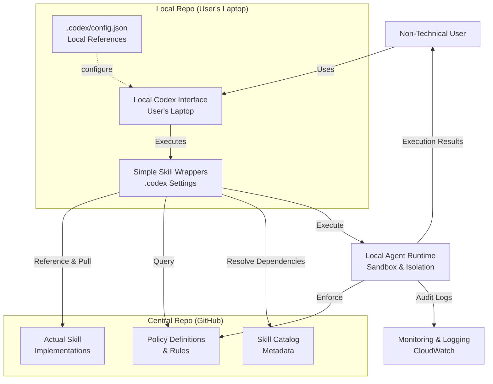

# Edge Agent MVP — Technical Specification Document

**Spec ID:** SPEC-20260428-001
**Associated PRD / Epic:** N/A
**ADO Epic:** N/A
**Status:** Draft
**Author:** Carlson Hoo (carlson.hoo@gmail.com)
**Tech Lead:** TBD
**Created Date:** 2026-04-28
**Updated Date:** 2026-04-28

---

## Executive Summary

> **Summary for Technical Manager and Product Owner**

Edge Agent MVP addresses the challenge of enabling non-technical users to rapidly iterate and release automated workflows through a **two-repo architecture**: a lightweight local repo on the user's laptop (with Codex interface and simple skill wrappers) consumes centralized skill implementations and policies from a GitHub-hosted central repo. This separation enables rapid skill iteration, centralized policy management, and local execution with strong sandboxing. This MVP establishes the foundation for future evolution toward remote agent infrastructure and MCP interface.

| Item | Description |
|------|-------------|
| **Problem Solved** | Non-technical users struggle to rapidly iterate and release agent skills; centralized policies must be maintained |
| **Technical Direction** | Two-repo pattern: lightweight local repo (Codex + wrappers) + GitHub central repo (implementations + policies) + local agent runtime |
| **Impact Scope** | Codex integration, dual-repo skill management, local agent execution, GitHub connectivity, policy enforcement |
| **Key Dependencies** | GitHub access, local repo setup, Codex permission configuration, skill validation framework |
| **Target Launch** | [TBD] |

---

## Background & Goals

### Background

Current centralized agent systems (e.g., Sizer) are designed for large-scale, cross-system automation with strict integration requirements. However, many business processes—especially in international branches and operation centers—exhibit high variability, difficult integration requirements, and geographical distribution. Edge Agent MVP aims to enable autonomous automation with defined boundaries on local devices by deploying lightweight, edge-based agents, allowing rapid automation without complex system integration.

### Goals

1. Enable local automation — Deploy agents on personal devices and office equipment
2. Support complex workflows — Handle multi-step processes (Singapore branch ML approval flows, operation center compliance reviews)
3. Maintain safety & compliance — Control data access, restrict dangerous actions, maintain audit trails
4. Preserve operational knowledge — Capture and reuse workflow intelligence across teams
5. Stabilize long-running tasks — Keep agent performance consistent over extended execution periods
6. Create a maturity path — Prove edge agent capability, eventually move mature workflows to centralized systems

### Non-Goals

- [TBD] Complete remote agent infrastructure (planned for subsequent iterations)
- [TBD] Direct database connectivity (MVP focuses on file-based workflows)
- [TBD] Complex machine learning model deployment

---

## System Architecture

### Architecture Overview Diagram

### Component Description

| Component | Role | Existing / New | Notes |
|-----------|------|----------------|-------|
| **Local Repo (Laptop)** | | | |
| Codex Interface | User interaction point for non-technical users with restricted operations | New | Runs on user's laptop; accepts natural language commands |
| Simple Skill Wrappers | Lightweight skill references that delegate to central repo implementations | New | Defined in local repo; pulls actual implementations from central repo |
| .codex Configuration | Local settings and environment configuration | New | Stored in `.codex/config.json`; defines local references and permissions |
| **Central Repo (GitHub)** | | | |
| Actual Skill Implementations | Complete skill code, logic, and dependencies | New | Centralized; version-controlled; shared across users |
| Policy Definitions & Rules | Organizational policies, access controls, and compliance rules | New | Centralized; referenced by local repo during execution |
| Skill Catalog & Metadata | Skill discovery, versioning, and dependency information | New | Enables skill resolution and version management |
| **Execution & Validation** | | | |
| Local Agent Runtime | Executes skill wrappers on local device, enforcing sandbox and policy boundaries | New | Resolves actual skills from central repo; enforces data isolation |
| Policy Engine | Validates skills and operations against organizational policies before and during execution | New | References central policy definitions; static + dynamic monitoring [TBD] |
| Monitoring & Logging | Tracks all agent operations, decisions, and audit events | New | CloudWatch integration [TBD]; logs to centralized store |

---

## Detailed Design

### Component Design

#### Codex Interface & Permission Control (Local Repo)

- **Responsibility:** Provide non-technical users with a natural language interface to query and execute skill wrappers locally while enforcing permission and policy boundaries
- **Location:** User's laptop (local repo)
- **Trigger Condition:** User natural language commands, skill execution requests from Codex
- **Input:** User natural language instructions, skill wrapper names, parameters
- **Output:** Execution results, logs, status updates
- **Dependencies:** Local skill wrappers, central repo (for actual implementations), policy engine, local agent runtime

**Design Focus:**
- [TBD] Specific list of operations Codex can and cannot perform
- [TBD] How skill wrappers reference and invoke central repo implementations
- [TBD] Integration approach between policy validation and Codex
- [TBD] Error handling and fallback mechanisms when central repo is unreachable

#### Central Repo (GitHub) — Skill Library & Policies

- **Responsibility:** Centrally manage and version-control actual skill implementations, policies, and metadata for consumption by local repos
- **Location:** GitHub (centralized)
- **Trigger Condition:** Skill addition, update, policy changes, deployment
- **Input:** Skill implementations (code, logic, dependencies), policy definitions, metadata
- **Output:** Skill catalog, policy definitions, version control, downloadable skill packages
- **Dependencies:** None (source system)

**Design Focus:**
- [TBD] Folder structure and naming conventions for skills and policies
- [TBD] Skill metadata format: version, dependencies, required policies, entry points
- [TBD] Policy definition format: rules, access controls, restrictions
- [TBD] Access control: who can publish/update skills and policies
- [TBD] Versioning strategy and backward compatibility approach
- [TBD] How local repos discover and pull updates from central repo

#### Local Agent Runtime (Local Repo)

- **Responsibility:** Safely execute skill wrappers on local devices by resolving and running actual implementations from central repo, while enforcing data boundaries and behavior restrictions
- **Location:** User's laptop (local repo)
- **Trigger Condition:** Skill execution requests from Codex or local triggers
- **Input:** Skill wrapper references, parameters, policy context (from central repo)
- **Output:** Execution results, audit logs, status
- **Dependencies:** Central repo (for actual skill implementations), local repo (for wrappers), policy engine, central policies

**Design Focus:**
- [TBD] How to resolve skill wrappers to actual implementations in central repo
- [TBD] Skill loading and execution mechanism (fetch from central, execute locally)
- [TBD] Data boundary enforcement (file system access control, sandbox isolation)
- [TBD] Behavior restrictions (allowed/forbidden operations, enforced from central policies)
- [TBD] Offline fallback: how to handle central repo unavailability
- [TBD] Long-duration execution stability mechanisms

#### Policy Engine

- **Responsibility:** Validate skills and operations before execution (enforcing central policies), monitor for anomalies during execution
- **Trigger Condition:** Skill execution requests, runtime monitoring checks
- **Input:** Skill definitions, central policy definitions, execution context, runtime metrics
- **Output:** Validation results (approved/rejected), monitoring alerts
- **Dependencies:** Central repo (policy definitions), audit logs, local agent runtime

**Design Focus:**
- [TBD] How to fetch and cache policy definitions from central repo
- [TBD] Static policy checks at skill startup (verify wrappers match policies)
- [TBD] Dynamic policy monitoring during execution (enforce restrictions)
- [TBD] Human-in-the-loop approval checkpoints for restricted operations
- [TBD] Policy versioning and update strategy

---

### Two-Repo Architecture Pattern

The MVP uses a **two-repository pattern** to separate concerns and enable scalable skill management:

#### Local Repo (User's Laptop)
- **Purpose:** User-facing skill workspace with Codex interface and skill wrapper definitions
- **Contains:**
  - `.codex/config.json` — Configuration, local settings, references to central repo
  - `skills/` — Simple skill wrapper definitions (metadata, parameters, entry points)
  - Local execution logs and temporary state
- **Characteristics:** Lightweight, minimal; user can modify local wrappers
- **Ownership:** Individual users or teams managing their own automation

#### Central Repo (GitHub)
- **Purpose:** Centralized skill library and policy management
- **Contains:**
  - `skills/` — Actual skill implementations (code, logic, dependencies)
  - `policies/` — Policy definitions and rules (access controls, restrictions)
  - `metadata/` — Skill catalog, versioning, dependency metadata
  - Complete version history and audit trail
- **Characteristics:** Authoritative source of truth; version-controlled; shared across users
- **Ownership:** Platform/security team managing centralized skills and policies

#### Integration Pattern
1. Local repo's skill wrappers reference skill names and versions in central repo
2. At execution time, local agent runtime resolves wrappers to actual implementations
3. Policy engine fetches applicable policies from central repo
4. Execution occurs locally with sandbox and policy enforcement

### API / Interface Specification

**N/A — MVP phase focuses on Codex user interface and local execution; API design deferred to remote agent phase**

---

### Data Models / Schema

#### Skill Wrapper (Local Repo) — skill-wrapper.json

| Field | Type | Description | Example Value |
|-------|------|-------------|----------------|
| `name` | String | Wrapper skill name (local reference) | `approval-workflow` |
| `centralSkillRef` | String | Reference to central repo skill | `central-repo/skills/approval-workflow` |
| `version` | String | Wrapper version (independent of central) | `1.0.0` |
| `description` | String | Local wrapper purpose | `Singapore branch approval wrapper` |
| `parameters` | Object | User-facing parameters | `{"approvalThreshold": 100}` |
| `requiredPolicies` | Array[String] | Required policy labels for execution | `["read-files", "write-approved"]` |

#### Skill Definition (Central Repo) — skill-manifest.json

| Field | Type | Description | Example Value |
|-------|------|-------------|----------------|
| `name` | String | Skill name in central repo | `approval-workflow` |
| `version` | String | Semantic versioning | `1.0.0` |
| `description` | String | Skill purpose description | `Generic ML approval flow` |
| `requiredPolicies` | Array[String] | Policy labels required for execution | `["read-files", "write-approved"]` |
| `dataScope` | Object | Data boundary definition | `{"readPath": "/workspace", "writePath": "/output"}` |
| `timeout` | Integer | Maximum execution time (seconds) | `3600` |
| `dependencies` | Array[String] | List of dependent skills | `["base-validation"]` |
| `entryPoint` | String | Main execution function/script | `main.sh` or `execute.py` |

#### Policy Definition (Central Repo) — policy-manifest.json

| Field | Type | Description | Example Value |
|-------|------|-------------|----------------|
| `policyLabel` | String | Policy identifier | `read-files` |
| `description` | String | What this policy permits | `Read access to workspace files` |
| `allowedPaths` | Array[String] | Permitted file paths | `["/workspace/**"]` |
| `allowedOperations` | Array[String] | Permitted operations | `["read", "list"]` |
| `deniedOperations` | Array[String] | Explicitly forbidden operations | `["delete", "modify"]` |
| `requiresApproval` | Boolean | Whether human approval required | `true` |

#### Audit Log Entry

| Field | Type | Description | Example Value |
|-------|------|-------------|----------------|
| `timestamp` | ISO-8601 | Event occurrence time | `2026-04-28T10:30:00Z` |
| `agent_id` | String | Agent identifier | `edge-agent-001` |
| `skill_name` | String | Executed skill (wrapper name) | `approval-workflow` |
| `central_skill_ref` | String | Central repo skill reference | `central-repo/skills/approval-workflow` |
| `action` | String | Executed operation | `read-file` / `write-file` / `execute-skill` |
| `status` | String | Operation result | `success` / `blocked` / `failed` |
| `reason` | String | Reason if blocked | `Policy violation: unauthorized write path` |

---

## Infrastructure & Deployment

### AWS Resource Inventory

| Resource Type | Name / ARN | Existing / New | Description |
|---------------|-----------|----------------|-------------|
| [TBD] CloudWatch Logs | [TBD] | New | Agent and skill execution logs |
| [TBD] CloudWatch Alarms | [TBD] | New | Agent anomalies and policy violation alerts |
| [TBD] Secrets Manager | [TBD] | New | GitHub authentication credentials [TBD] |

### IaC Design (Terraform)

[TBD] — MVP phase focuses on local execution; infrastructure code deployment deferred to production deployment phase

### Environment Planning

| Environment | Description | Special Configuration |
|-------------|-------------|----------------------|
| dev | Developer local testing | [TBD] |
| staging | Compliance testing | [TBD] |
| prod | Production deployment to edge devices | [TBD] |

---

## Considerations

### ✅ Mandatory Items

#### 1. Scalability

[TBD] — Plan how to handle:
- Increased number of agents (multiple agents per branch)
- Skill library expansion (large number of new skills)
- Concurrent execution requirements

---

#### 2. Reliability / Availability

[TBD] — Plan how to ensure:
- Agent long-duration execution stability
- Skill failure recovery mechanisms
- Backup mechanisms when GitHub connectivity fails

---

#### 3. Security

[TBD] — Plan how to implement:
- Authentication and authorization
- Data encryption (in transit and at rest)
- Credential management (GitHub tokens, policy authentication)
- Network isolation

---

#### 4. Observability

[TBD] — Plan how to monitor:
- Agent health status
- Skill execution metrics
- Policy violation events
- Audit logs and tracing

---

## Testing Strategy

| Test Type | Coverage | Priority |
|-----------|----------|----------|
| Policy validation testing | Ensure policy engine correctly blocks unauthorized operations | P1 |
| Skill execution testing | Ensure skills load and execute correctly | P1 |
| Data boundary testing | Ensure agents cannot access files outside boundaries | P1 |
| Long-duration stability testing | Verify agent stability over 24+ hour executions | P2 |
| Audit log completeness testing | Ensure all operations are logged correctly | P2 |

### Acceptance Criteria

- [ ] Codex interface implemented and accepting non-technical user commands
- [ ] Policy engine validates all skill executions for compliance before execution
- [ ] GitHub skill library established with proper version control
- [ ] Local agent runtime successfully executes sample workflows (Singapore branch approval flow, operation center compliance review)
- [ ] All agent operations recorded in audit logs
- [ ] Data boundary enforcement effective (agent cannot escape sandbox)

---

## Rollout Plan

### Rollout Steps

1. [TBD] Implement Codex permission control layer
2. [TBD] Establish GitHub skill library and skill catalog structure
3. [TBD] Implement local agent runtime and sandbox mechanism
4. [TBD] Develop policy validation and dynamic monitoring engine
5. [TBD] Implement audit logging system
6. [TBD] Execute compliance and security review
7. [TBD] Deploy to initial user groups (Singapore branch, operation centers)
8. [TBD] Monitor early adoption and iterate

### Rollback Plan

[TBD] — Define emergency rollback procedures if policy, security, or stability issues are discovered

### Post-Launch Verification

[TBD] — Post-launch verification items:
- Agent and skill execution functioning normally
- Policy enforcement effective
- Audit logs complete
- User feedback and iteration requirements

---

## Open Questions

| Question | Owner | Deadline | Status |
|----------|-------|----------|--------|
| What should be the specific permission restrictions for Codex? | [TBD] | [TBD] | Open |
| How should GitHub connectivity failures be handled? (Offline support?) | [TBD] | [TBD] | Open |
| What are the specific targets for long-duration execution stability? (Duration?) | [TBD] | [TBD] | Open |
| When should MCP interface be implemented? (Post-MVP?) | [TBD] | [TBD] | Open |
| Which teams are the initial pilot users? (Singapore branch?) | [TBD] | [TBD] | Open |
| Who should manage policy definitions? (Security team?) | [TBD] | [TBD] | Open |

---

## Approval Record

| Role | Name | Status | Date |
|------|------|--------|------|
| Tech Lead | TBD | Pending Approval | — |
| Technical Manager | TBD | Pending Approval | — |
| Security Lead | TBD | Pending Approval | — |

**Spec Status:** Draft

---

## Version History

| Version | Date | Author | Change Description |
|---------|------|--------|-------------------|
| 0.1.0 | 2026-04-28 | Carlson Hoo | Initial draft — architecture overview, component design, open questions |

---

## Appendix

### A. Industry Best Practice References

| Aspect | Source | Link | Relevance |
|--------|--------|------|-----------|
| **Scalability** | AWS Well-Architected | https://docs.aws.amazon.com/wellarchitected/latest/performance-efficiency-pillar/welcome.html | Performance Efficiency Pillar — horizontal scaling and capacity planning best practices |
| **Scalability** | The Twelve-Factor App | https://12factor.net/ | Cloud-native application scalability design principles |
| **Reliability** | AWS Well-Architected | https://docs.aws.amazon.com/wellarchitected/latest/reliability-pillar/welcome.html | Reliability Pillar — failover, redundancy, and SLA design |
| **Reliability** | Google SRE Book | https://sre.google/sre-book/table-of-contents/ | SRE practices: SLO / SLA / error budget definition approaches |
| **Security** | AWS Well-Architected | https://docs.aws.amazon.com/wellarchitected/latest/security-pillar/welcome.html | Security Pillar — IAM, encryption, network isolation |
| **Security** | OWASP API Security Top 10 | https://owasp.org/www-project-api-security/ | API security best practices applicable to all external endpoint design |
| **Observability** | OpenTelemetry | https://opentelemetry.io/docs/ | Industry-standard logging / metrics / tracing framework |
| **Observability** | AWS CloudWatch Best Practices | https://docs.aws.amazon.com/AmazonCloudWatch/latest/monitoring/Best_Practice_Recommended_Alarms_AWS_Services.html | AWS native observability design recommendations |
| **Disaster Recovery** | AWS DR Whitepaper | https://docs.aws.amazon.com/whitepapers/latest/disaster-recovery-workloads-on-aws/disaster-recovery-workloads-on-aws.html | RTO / RPO strategy and 4 DR modes |
| **Cost** | AWS Well-Architected | https://docs.aws.amazon.com/wellarchitected/latest/cost-optimization-pillar/welcome.html | Cost Optimization Pillar — FinOps and resource efficiency |
| **Testability** | AWS Lambda Testing Guide | https://docs.aws.amazon.com/lambda/latest/dg/testing-guide.html | Lambda / Serverless testing strategy |
| **Testability** | Chaos Engineering | https://principlesofchaos.org/ | Chaos engineering principles applicable to high-availability platform design |
| **Compliance** | CIS Benchmarks | https://www.cisecurity.org/cis-benchmarks | Industry-recognized security baseline standards applicable to AWS infrastructure compliance review |

### B. Spec-Specific References

| Topic | Source | Link | Relevance |
|-------|--------|------|-----------|
| GitHub API and CLI | GitHub | https://docs.github.com/en/rest | Skill library integration and version control |
| MCP (Model Context Protocol) | Anthropic | https://modelcontextprotocol.io/ | Future remote skill service interface design |
| [Technology Name] | [Source] | [Link] | [Description] |
