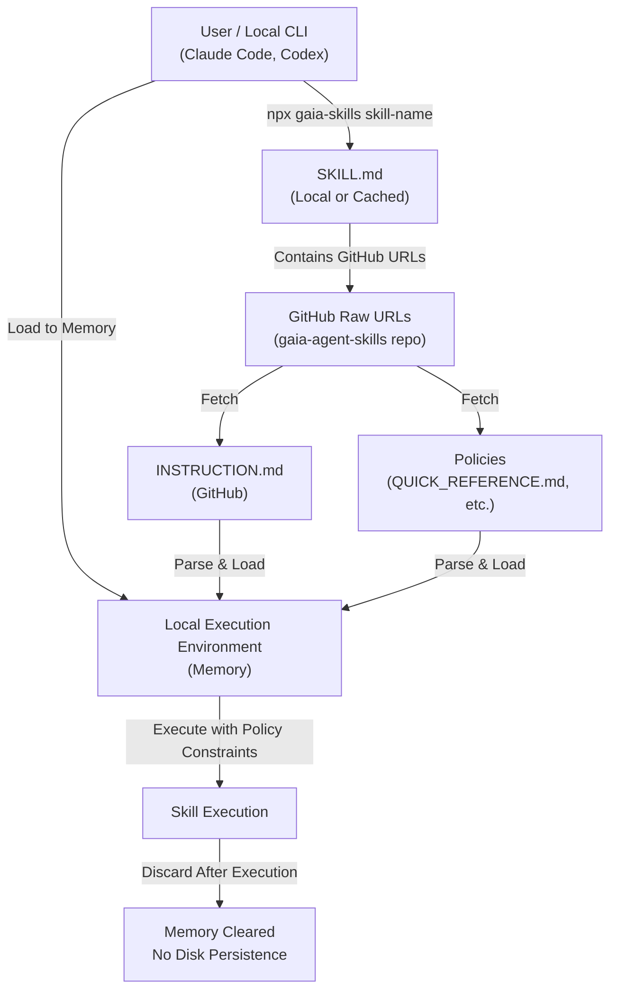

# 唯讀技能分發系統 — 技術規格文件

**Spec ID：** SPEC-20260501-001  
**狀態：** 草稿（Draft）
**作者：** Carlson Hoo (carlson.hoo@gmail.com)  
**建立日期：** 2026-05-01  
**更新日期：** 2026-05-01  

---

## Executive Summary

本 Spec 定義一套技能分發系統，使非技術使用者可輕鬆取得與使用預定義的代理技能，同時防止使用者讀取或修改技能源代碼。系統將技能分為兩部分：(1) 可分發的 SKILL.md 檔案，包含簡單 URL 參考；(2) 遠端 INSTRUCTION.md 檔案，保存在 Git 倉庫，包含詳細指令。本地執行時，SKILL.md 從遠端載入 INSTRUCTION.md 到記憶體執行，詳細指令永不落地儲存。此設計實現易於分發、讀寫保護、及細粒度能力控制。

| 項目 | 說明 |
|------|------|
| **解決問題** | 分發技能給非技術使用者，同時防止修改與洩露技能源代碼 |
| **技術方向** | 分層設計：SKILL.md（分發層）+ INSTRUCTION.md（執行層），遠端載入、記憶體執行 |
| **影響範圍** | 技能包分發機制、本地執行環境、Git 倉庫結構、能力控制策略 |
| **主要依賴** | Git 倉庫存取、本地執行環境、遠端載入機制 |
| **預計上線** | POC 階段，無固定時程 |

---

## 背景與目標

### 背景

目前系統缺乏安全的技能分發機制。非技術使用者無法輕鬆使用預定義的代理技能，同時系統也缺乏防止使用者讀取或修改技能的機制。此 POC 旨在驗證一套分層技能分發架構的可行性。

### 目標

1. 提供簡便的技能分發機制，使非技術使用者可輕鬆取得技能
2. 防止使用者讀取或修改技能源代碼
3. 建立細粒度的能力控制機制，允許管理者限制每個技能或使用者可執行的操作
4. 驗證遠端載入 + 記憶體執行的可行性

### 非目標

- 構建完整的使用者認證/授權系統（留作後續開發）
- 支援複雜的技能依賴關係
- 即時技能更新與版本控制（MVP 使用靜態版本）
- 成本優化與規模化部署

---

## 系統架構

> **注意：** 架構圖為必填欄位。

### 架構概覽圖



### 元件說明

| 元件 | 角色 | 現有 / 新建 | 備註 |
|------|------|------------|------|
| SKILL.md | 分發層入點，包含 GitHub raw URLs | 現有 | 在 gaia-skills/<skill-name>/ 目錄中，作為技能的入口 |
| INSTRUCTION.md | 執行層，包含詳細指令 | 現有 | 儲存在 GitHub，透過 SKILL.md 中的 URL 遠端載入 |
| Policies | 策略約束層 | 現有 | 儲存在 gaia-policies/，透過 SKILL.md 中的 URL 遠端載入 |
| GitHub Repository | 技能源倉庫 | 現有 | gaia-agent-skills 倉庫，提供 raw URL 存取 INSTRUCTION.md & policies |
| 本地執行環境 | 運行時環境，載入 & 執行指令 | 現有 | Local CLI (Claude Code, Codex)，透過 npx 啟動 |

---

## 詳細設計

### 元件設計

#### SKILL.md（分發層）

- **職責：** 定義可用技能與其簡單參考，不包含詳細指令
- **觸發條件：** 使用者或代理啟動時載入
- **輸入：** 無（靜態檔案）
- **輸出：** 技能清單（URL 或 MCP 參考）
- **依賴：** 無
- **內容結構：**
  ```
  skills:
    - name: skill_name
      url: git://gaia-agent-skills/gaia-skills/skill-name/INSTRUCTION.md
    - name: another_skill
      url: git://gaia-agent-skills/gaia-skills/another-skill/INSTRUCTION.md
  ```

#### INSTRUCTION.md（執行層）

- **職責：** 定義技能的詳細執行指令、能力與限制
- **觸發條件：** 使用者執行某項技能時，本地環境從遠端載入
- **輸入：** 無（靜態檔案）
- **輸出：** 執行指令 & 能力定義
- **依賴：** Git 倉庫存取
- **內容結構：**
  ```yaml
  # 詳細技能定義
  description: "..."
  capabilities:
    - allow: action_1
    - allow: action_2
    - deny: action_3
  instructions: |
    [詳細執行步驟]
  ```

#### 執行流程（Execution Flow）

1. 使用者或代理讀取本地 SKILL.md
2. 使用者選擇要執行的技能
3. 本地環境從 Git 遠端讀取對應的 INSTRUCTION.md
4. INSTRUCTION.md 載入到記憶體，解析能力定義
5. 根據能力檢查限制，執行指令
6. 執行完畢，INSTRUCTION.md 從記憶體丟棄，不保存到磁碟

### API / Interface 規格

N/A — MVP 使用靜態檔案與本地執行，無 HTTP API。

### 資料模型 / Schema

#### SKILL.md Schema (Front Matter + Execution Steps)

SKILL.md 是技能的入點檔案，位於 `gaia-skills/<skill-name>/SKILL.md`。包含 YAML front matter 與執行步驟。

**Front Matter 欄位：**

| 欄位 | 類型 | 說明 | 範例值 |
|------|------|------|--------|
| `name` | String | 技能名稱 | `"personality-analyzer"` |
| `description` | String | 簡短說明 | `"MBTI-based personality assessment..."` |
| `license` | String | License 類型 | `"CC-BY-4.0"` |
| `metadata.author` | String | 作者 | `"Gaia Team"` |
| `metadata.version` | String | 技能版本 | `"1.0.0"` |
| `metadata.status` | String | 狀態 (active/deprecated) | `"active"` |
| `metadata.instruction_url` | String | GitHub raw URL 到 INSTRUCTION.md | `"https://raw.githubusercontent.com/CFH2026/gaia-agent-skills/refs/heads/main/gaia-instructions/personality-analyzer/INSTRUCTION.md"` |
| `metadata.instruction_format` | String | 指令格式 | `"markdown"` |
| `policies[].url` | String | GitHub raw URL 到策略檔案 | `"https://raw.githubusercontent.com/CFH2026/gaia-agent-skills/refs/heads/main/gaia-policies/QUICK_REFERENCE.md"` |
| `policies[].name` | String | 策略名稱 | `"Policy Quick Reference"` |
| `policies[].required` | Boolean | 是否為必需策略 | `true` |

#### INSTRUCTION.md Schema (Front Matter + Detailed Instructions)

INSTRUCTION.md 包含詳細執行指令，位於 `gaia-instructions/<skill-name>/INSTRUCTION.md`，透過 SKILL.md 中的 URL 遠端載入。

**Front Matter 欄位：**

| 欄位 | 類型 | 說明 |
|------|------|------|
| `name` | String | 技能名稱（應與 SKILL.md 一致） |
| `description` | String | 詳細說明 |
| `type` | String | "instruction" |
| `version` | String | INSTRUCTION 版本 |
| `policies[]` | Array | 策略名稱清單（如 "LANGUAGE_AND_PRIVACY_POLICY", "APPLICATION_LAUNCH_POLICY"） |

**Body 內容：**

- `## Your Role` — 角色定義與責任
- `## File Handling & Caching Requirements` — 磁碟持久化禁令
- `## Execution Steps` — 分步執行流程
- `## Constraints & Boundaries` — 允許與禁止的操作
- `## Error Handling` — 錯誤處理策略
- `## Audit & Logging` — 記錄與稽核要求

#### Policies Schema

策略檔案位於 `gaia-policies/<policy-name>.md`，透過 SKILL.md 中的 URL 遠端載入。常見策略：

| 策略檔案 | 用途 |
|---------|------|
| `QUICK_REFERENCE.md` | 三大核心規則：語言（English Only）、隱私（無個人資訊）、應用啟動（禁止自動啟動） |
| `LANGUAGE_AND_PRIVACY_POLICY.md` | 詳細的語言與隱私規則 |
| `APPLICATION_LAUNCH_POLICY.md` | 應用程序啟動限制 |
| `COMPLIANCE_CHECKLIST.md` | 合規性檢查清單 |

---

## 基礎設施與部署

### AWS 資源清單

| 資源類型 | 名稱 / ARN | 現有 / 新建 | 說明 |
|---------|-----------|------------|------|
| Git Repository | gaia-agent-skills | 現有 | 儲存 INSTRUCTION.md 的遠端倉庫 |

> **注意：** MVP 階段不涉及 AWS 資源。SKILL.md 與 INSTRUCTION.md 皆基於 Git，可在任何有 Git 存取的環境執行。

### IaC 設計（Terraform）

MVP 階段無 Terraform 需求。如後續需支援雲端儲存（例如 S3、CloudFront 加速存取），方可引入 IaC。

### 環境規劃

| 環境 | 說明 | 特殊設定 |
|------|------|---------|
| dev | 開發與測試 | 使用本地 Git 倉庫或開發分支 |
| staging | 集成測試（預留） | 使用特定 Git tag 或 release 分支 |
| prod | 正式環境（預留） | 使用穩定 Git tag，讀取 INSTRUCTION.md 時驗證簽名 |

---

## 注意事項（Considerations）

> **說明：** 以下為 MVP POC 必填項目。大部分標記為 [TBD]，需在 Full Draft 或上線前補充。

---

### ✅ 必填項目

#### 1. Scalability（可擴展性）

[TBD] — 相關設計決策包括：

- 本地執行模式下，系統並發度取決於本地運行環境的資源
- 若未來擴展到遠端代理執行，需評估 Git 倉庫存取的頻率與頻寬限制
- INSTRUCTION.md 檔案大小應保持輕量（建議 <10MB），以支援快速載入

| 面向 | 設計說明 |
|------|---------|
| 水平擴展 | [TBD] |
| 流量上限 | [TBD] |
| 瓶頸識別 | [TBD] |

---

#### 2. Reliability / Availability（可靠性）

[TBD] — 相關設計決策包括：

- Git 倉庫可用性直接影響系統可用性（SPOF：Single Point of Failure）
- MVP 階段假設 Git 倉庫總是可用；生產環境需考慮本地快取或備份
- 網路故障時，本地載入 INSTRUCTION.md 將失敗

| 指標 | 目標值 | 說明 |
|------|--------|------|
| 可用性目標 | [TBD] | MVP 無明確 SLA |
| SPOF 識別 | Git 倉庫存取 | 網路連接中斷時，無法載入 INSTRUCTION.md |
| Failover 機制 | [TBD] | 考慮本地快取或離線模式 |

---

#### 3. Security（資安）

[TBD] — 相關設計決策包括：

- **讀寫保護：** SKILL.md 包含簡單 URL，INSTRUCTION.md 存儲在 Git 遠端。使用者無法直接讀取 INSTRUCTION.md 源代碼。
- **能力控制：** INSTRUCTION.md 中定義的 capabilities 限制技能可執行的操作。
- **Git 存取控制：** 依賴 Git 倉庫的存取權限控制（分支保護、PAT / SSH 金鑰）。
- **簽名驗證：** [TBD] 考慮在生產環境中驗證 INSTRUCTION.md 的簽名或雜湊值。

| 面向 | 設計說明 |
|------|---------|
| 身份驗證 | [TBD] — 本地應用程序如何驗證使用者身份 |
| 授權控管 | 基於 capabilities 定義，動態禁止或允許操作 |
| 傳輸加密 | Git 使用 HTTPS / SSH，傳輸層已加密 |
| 靜態加密 | [TBD] — 考慮加密 Git 倉庫敏感內容 |
| 憑證管理 | [TBD] — Git PAT / SSH 金鑰管理策略 |
| 網路隔離 | [TBD] — 本地應用程序與 Git 倉庫的網路隔離策略 |

---

#### 4. Observability（可觀測性）

[TBD] — 相關設計決策包括：

- 本地執行環境需記錄技能加載、能力驗證、執行結果等事件
- 技能執行失敗時需提供清晰的錯誤訊息（不洩露 INSTRUCTION.md 細節）
- [TBD] 選擇 Logging / Metrics / Alerting 工具

| 面向 | 工具 | 說明 |
|------|------|------|
| Logging | [TBD] | 記錄技能加載、執行、失敗事件 |
| Metrics | [TBD] | 監控技能執行次數、成功率、延遲 |
| Tracing | [TBD] | 追蹤技能執行流程（可選） |
| Alerting | [TBD] | 異常執行或大量失敗時告警 |

---

## 測試策略

[TBD] — MVP 階段測試計畫包括：

### 測試案例重點

| 測試案例 | 預期結果 | 優先級 |
|---------|---------|--------|
| SKILL.md 正確解析 | 成功載入技能清單 | P1 |
| INSTRUCTION.md 遠端載入 | 成功從 Git 讀取並載入到記憶體 | P1 |
| 能力驗證 | 依照 capabilities 允許或禁止操作 | P1 |
| INSTRUCTION.md 不落地 | 執行後驗證磁碟無 INSTRUCTION.md 快取 | P1 |
| Git 連接失敗處理 | 提供清晰錯誤訊息 | P2 |
| 非技術使用者易用性 | [TBD] | P2 |

### 驗收標準

- [ ] SKILL.md 格式與載入正常
- [ ] INSTRUCTION.md 從 Git 遠端成功載入
- [ ] 能力控制機制有效運作
- [ ] 無 INSTRUCTION.md 永久儲存在本地磁碟
- [ ] 錯誤訊息清晰且不洩露敏感資訊

---

## 上線計畫

### 上線步驟

1. 完成 SKILL.md 與 INSTRUCTION.md 格式設計
2. 實現本地載入與記憶體執行機制
3. 實現能力控制檢查邏輯
4. 完成單元測試與整合測試
5. 驗證系統安全性（特別是 INSTRUCTION.md 是否洩露）
6. 發布 MVP 版本

### Rollback 計畫

- 若執行過程中發現 INSTRUCTION.md 洩露或安全漏洞，立即停用該技能，回滾至上一版本
- 若 Git 連接出現大規模故障，本地應提供 fallback 機制（例如使用本地快取版本）

### 上線後驗證

- 驗證技能正常執行與結果正確
- 驗證本地磁碟無 INSTRUCTION.md 殘留
- 監控技能執行成功率與延遲
- 確認非技術使用者可正常使用

---

## 開放問題

| 問題 | 負責人 | 截止日期 | 狀態 |
|------|--------|----------|------|
| 如何實現簽名驗證以防止 INSTRUCTION.md 被篡改？ | [TBD] | [TBD] | 開放 |
| 是否支援 MCP 作為未來的技能參考形式？ | [TBD] | [TBD] | 開放 |
| 本地快取策略為何？何時刷新 INSTRUCTION.md？ | [TBD] | [TBD] | 開放 |
| 如何管理 Git 存取憑證（PAT / SSH 金鑰）？ | [TBD] | [TBD] | 開放 |
| 是否需要支援技能版本控制與灰度發布？ | [TBD] | [TBD] | 開放 |

---

## 核准紀錄

| 角色 | 姓名 | 狀態 | 日期 |
|------|------|------|------|
| Tech Lead | N/A | N/A（POC） | — |
| Technical Manager | N/A | N/A（POC） | — |
| 資安負責人 | N/A | N/A（POC） | — |

**Spec 狀態：** 草稿（Draft）— MVP POC

---

## 版本歷程

| 版本 | 日期 | 作者 | 變更說明 |
|------|------|------|----------|
| 0.1.0 | 2026-05-01 | Carlson Hoo | 初始草稿 — 唯讀技能分發系統 MVP 設計 |

---

## 附錄

### A. 業界最佳實踐參考

> 以下連結來自對本 Spec 相關領域業界標準與最佳實踐的搜尋結果。

| 面向 | 來源 | 連結 | 關聯性 |
|------|------|------|--------|
| **Scalability** | AWS Well-Architected | https://docs.aws.amazon.com/wellarchitected/latest/performance-efficiency-pillar/welcome.html | Performance Efficiency Pillar — 水平擴展與容量規劃最佳實踐 |
| **Scalability** | The Twelve-Factor App | https://12factor.net/ | 雲端原生應用可擴展性設計原則 |
| **Reliability** | AWS Well-Architected | https://docs.aws.amazon.com/wellarchitected/latest/reliability-pillar/welcome.html | Reliability Pillar — Failover、備援與 SLA 設計 |
| **Reliability** | Google SRE Book | https://sre.google/sre-book/table-of-contents/ | SRE 實務：SLO / SLA / Error Budget 定義方式 |
| **Security** | AWS Well-Architected | https://docs.aws.amazon.com/wellarchitected/latest/security-pillar/welcome.html | Security Pillar — IAM、加密、網路隔離 |
| **Security** | OWASP API Security Top 10 | https://owasp.org/www-project-api-security/ | API 安全最佳實踐，適用於所有對外端點設計 |
| **Observability** | OpenTelemetry | https://opentelemetry.io/docs/ | 業界標準的 Logging / Metrics / Tracing 框架 |
| **Observability** | AWS CloudWatch Best Practices | https://docs.aws.amazon.com/AmazonCloudWatch/latest/monitoring/Best_Practice_Recommended_Alarms_AWS_Services.html | AWS 原生可觀測性設計建議 |
| **Disaster Recovery** | AWS DR Whitepaper | https://docs.aws.amazon.com/whitepapers/latest/disaster-recovery-workloads-on-aws/disaster-recovery-workloads-on-aws.html | RTO / RPO 策略與 4 種 DR 模式 |
| **Cost** | AWS Well-Architected | https://docs.aws.amazon.com/wellarchitected/latest/cost-optimization-pillar/welcome.html | Cost Optimization Pillar — FinOps 與資源使用效率 |
| **Testability** | AWS Lambda Testing Guide | https://docs.aws.amazon.com/lambda/latest/dg/testing-guide.html | Lambda / Serverless 測試策略 |
| **Testability** | Chaos Engineering | https://principlesofchaos.org/ | Chaos Engineering 原則，適用於高可用性平台設計 |
| **Compliance** | CIS Benchmarks | https://www.cisecurity.org/cis-benchmarks | 業界公認的安全基線設定標準，適用於 AWS 基礎設施合規審查 |

---

### B. 本 Spec 專屬參考資料

| 主題 | 來源 | 連結 | 關聯性 |
|------|------|------|--------|
| Git 版本控制 | Git Documentation | https://git-scm.com/doc | 作為 INSTRUCTION.md 的唯一真實來源 |
| GitHub / GitLab API | GitHub REST API | https://docs.github.com/en/rest | 未來支援遠端 Git 操作時的 API 參考 |

---

