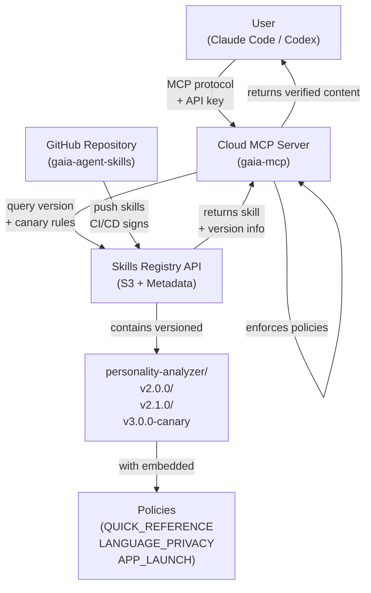

# MCP-Based Skill Distribution System — Phase 2 技術規格文件

**Spec ID：** SPEC-20260501-002  
**狀態：** 草稿（Draft）  
**作者：** Carlson Hoo (carlson.hoo@gmail.com)  
**建立日期：** 2026-05-01  
**更新日期：** 2026-05-01  
**Predecessor：** SPEC-20260501-001 (Phase 1: Read-Only Skill Distribution)

---

## Executive Summary

Phase 2 replaces the Phase 1 architecture (npx CLI + GitHub raw URLs) with a **cloud-hosted MCP (Model Context Protocol) server** that serves skills as MCP tool calls. This design:

1. **Eliminates URL manipulation attacks** — MCP server has hardcoded GitHub paths; users cannot override
2. **Moves policy enforcement server-side** — Policies are validated before content is served; user cannot bypass
3. **Adds cryptographic verification** — All INSTRUCTION.md files are signed; tampering is detected
4. **Requires authentication** — Only authorized users can access skills (API key)
5. **Simplifies client UX** — Users invoke `/skill-name` instead of `npx agent-skills-cli run skill-name`

**Result:** Users can no longer read, modify, bypass, or tamper with skill content.

| 項目 | 說明 |
|------|------|
| **解決問題** | Phase 1 security gaps: editable SKILL.md URLs, client-side policy enforcement, no authentication, no tampering detection |
| **技術方向** | Cloud MCP server + embedded policies + signature verification + API key authentication |
| **影響範圍** | Complete replacement of skill distribution channel; npx CLI → MCP protocol; new signing CI/CD workflow |
| **主要依賴** | Cloud infrastructure (AWS Lambda / Cloudflare), GitHub Secrets, MCP protocol support in Claude Code / Codex |
| **預計上線** | Full Phase 2 with security hardening; estimated 3-4 weeks after Phase 1 completion |

---

## 背景與目標

### 背景

Phase 1 introduced a read-only skill distribution system, but identified security gaps:

1. **URL Override Attack** — User can edit local SKILL.md to change `instruction_url` from official GitHub to attacker's server
2. **External Policy URLs** — Policies are separate files; users can remove policy URLs to skip enforcement
3. **No Authentication** — Any user can fetch any skill (no access control)
4. **Client-Side Policy Enforcement** — Agent voluntarily honors policies (agent can be manipulated)
5. **No Tampering Detection** — If INSTRUCTION.md is modified in transit or on GitHub, no cryptographic proof

Phase 2 addresses all five gaps by moving the distribution and enforcement layer to a cloud-hosted MCP server.

### 目標

1. **Replace npx CLI** — Users invoke skills via MCP tools (`/skill-name`) instead of `npx agent-skills-cli run skill-name`
2. **Centralize Fetching** — MCP server (not client) fetches from GitHub; client never sees GitHub URLs
3. **Server-Side Policy Enforcement** — MCP server validates request against embedded policies before serving content
4. **Add Authentication** — API key required; only authorized users can access skills
5. **Enable Signature Verification** — All INSTRUCTION.md files are cryptographically signed; tampering detected
6. **Incorporate All Phase 2 Security Proposals** — Embedded policies + hardcoded URLs + signatures

### 非目標

- Complete user authentication/authorization system (Phase 3+)
- Billing and usage metering (Phase 3+)
- Multi-tenant or team-based access control (Phase 3+)
- Offline skill cache (Phase 3+)

---

## 系統架構

### 架構概覽圖



### 元件說明

| 元件 | 角色 | 現有 / 新建 | 備註 |
|------|------|------------|------|
| Cloud MCP Server | 驗證 API 金鑰、查詢版本、執行政策檢查 | 新建 | 部署於 AWS Lambda 或 Cloudflare Workers |
| Skills Registry API | 儲存技能版本、支援金絲雀發布、提供版本元數據 | 新建 | S3 + DynamoDB 或 PostgreSQL；處理版本路由 |
| GitHub Repository | 技能源倉庫，儲存 INSTRUCTION.md | 現有 | `gaia-agent-skills` 倉庫；CI/CD 推送到 Registry |
| Claude Code / Codex | MCP 客戶端，調用 MCP 工具 | 現有 | 配置 MCP 伺服器連線 + API 金鑰 + 版本偏好 |
| CI/CD (GitHub Actions) | 簽署並發佈技能到 Registry | 新建 | 推送至 `main` 分支時自動發佈新版本 |

---

## 技能登錄表設計

### Skills Registry 概述

The Skills Registry is a versioned skill storage service that:
- Stores multiple versions of each skill (v1.0.0, v1.1.0, v2.0.0, v2.1.0-canary, etc.)
- Provides HTTP API for version queries and content retrieval
- Supports canary rollout rules (e.g., serve v1 to 10% of users, v2 to 90%)
- Maintains deployment traceability (who deployed which version when)
- Is updated by CI/CD on each GitHub push to main

**Registry Storage Options:**
- S3 + DynamoDB (AWS): Versioned objects in S3, metadata in DynamoDB
- S3 + PostgreSQL: Versioned objects in S3, metadata in database
- Artifact Repository: Nexus, Artifactory (if already in use)

**Registry API Endpoints:**
```
GET /skills                          → List all skills
GET /skills/{name}/versions          → List available versions
GET /skills/{name}/latest            → Get latest release
GET /skills/{name}/{version}/info    → Get metadata
GET /skills/{name}/{version}/instruction  → Get INSTRUCTION.md
POST /skills/{name}/canary           → Get canary version (route by user_id)
```

**Canary Rules Format:**
```json
{
  "skill_name": "personality-analyzer",
  "canary_config": {
    "enabled": true,
    "canary_version": "v2.1.0-canary",
    "stable_version": "v2.0.0",
    "canary_percentage": 10,
    "canary_user_ids": ["user_001", "user_002", ...]  // OR percentage-based routing
  }
}
```

---

## 詳細設計

### MCP 伺服器設計

#### Exposed Tools

MCP server exposes three tools to Claude Code / Codex:

| Tool | Parameters | Description | Auth |
|------|-----------|-------------|------|
| `list_skills` | (none) | Return list of available skills with versions | API key |
| `get_skill_info` | `skill_name`, `version` (optional) | Return SKILL.md metadata for specific version | API key |
| `execute_skill` | `skill_name`, `version` (optional) | Fetch INSTRUCTION.md from registry, validate policies, return content | API key |

#### Tool Behavior

**Tool: `list_skills`**
```json
Request: {}
Response: {
  "skills": [
    {
      "name": "personality-analyzer",
      "description": "MBTI-based personality assessment",
      "latest_version": "2.1.0",
      "available_versions": ["2.0.0", "2.1.0", "2.2.0-canary"],
      "status": "active",
      "policies_embedded": true
    },
    ...
  ]
}
```

**Tool: `get_skill_info`**
```json
Request: { "skill_name": "personality-analyzer", "version": "2.1.0" }
Note: If version omitted, returns latest version
Response: {
  "name": "personality-analyzer",
  "description": "MBTI-based personality assessment",
  "version": "2.1.0",
  "author": "Gaia Team",
  "license": "CC-BY-4.0",
  "published_at": "2026-05-01T08:00:00Z",
  "policies_embedded": true,
  "policies": ["LANGUAGE_AND_PRIVACY_POLICY", "APPLICATION_LAUNCH_POLICY", "QUICK_REFERENCE"]
}
```

**Tool: `execute_skill`**
```json
Request: { "skill_name": "personality-analyzer", "version": "2.1.0" }
Note: If version omitted, MCP queries registry for user's preferred version (or latest)
Note: If canary rules active, registry may return canary version based on user_id

Response: {
  "skill_name": "personality-analyzer",
  "version": "2.1.0",
  "instruction": "[full INSTRUCTION.md content with embedded policies]",
  "deployed_at": "2026-05-01T08:00:00Z",
  "policies_embedded": true,
  "served_at": "2026-05-01T10:00:00Z"
}

Error (signature fails): {
  "error": "Signature verification failed",
  "reason": "INSTRUCTION.md may have been tampered with",
  "timestamp": "2026-05-01T10:00:01Z"
}

Error (policy violation): {
  "error": "Policy violation",
  "policy": "APPLICATION_LAUNCH_POLICY",
  "reason": "Cannot serve skill from restricted context",
  "timestamp": "2026-05-01T10:00:02Z"
}
```

#### Authentication

- **Method:** API key in MCP connection config
- **Storage:** 
  - Claude Code: `~/.claude/settings.json` (MCP server config section)
  - Codex: `~/.codex/config.yaml` (MCP integration section)
- **Format:** Bearer token or API key passed in MCP initialization
- **Validation:** MCP server validates key on every request; reject if invalid or revoked

#### Policy Enforcement (Server-Side)

1. **Query Skills Registry** for requested skill version
2. **Parse embedded policies** (markdown sections in INSTRUCTION.md)
3. **Extract constraints:**
   - Language: English only
   - Privacy: No personal info collection
   - App Launch: No automatic application launches
   - File Handling: No disk persistence
4. **Validate request context:**
   - Is request from authorized user? (API key check)
   - Is skill marked as allowed? (status = active)
   - Are policies satisfied for this context?
   - Are there any runtime restrictions? (rate limit, time-based access)
5. **If validation passes:** Return INSTRUCTION.md from registry
6. **If validation fails:** Return error; do not serve content

**Note:** Registry is pre-validated at publish time (CI/CD). MCP server adds runtime policy enforcement.

---

## Security Design (All 3 Phase 2 Proposals)

### 1️⃣ Embedded Policies (from personality-analyzer PoC)

**Design:**
- All policy content embedded directly in INSTRUCTION.md
- No separate policy file URLs
- Policies are part of the returned skill content

**Benefits:**
- ✅ Policies cannot be removed (intrinsic to INSTRUCTION.md)
- ✅ No separate downloads (simpler)
- ✅ Always in sync with skill (no version mismatch)

**Reference Implementation:**
- `gaia-instructions/personality-analyzer/INSTRUCTION.md` (full example with 3 embedded policies)
- `docs/PROPOSAL-EMBEDDED-POLICIES.md` (design rationale and trade-offs)

---

### 2️⃣ Hardcoded URLs (in MCP Server, not Client)

**Design:**
- MCP server has hardcoded GitHub repository path: `CFH2026/gaia-agent-skills`
- Users call: `execute_skill("personality-analyzer")`
- Server internally constructs URL: `https://raw.githubusercontent.com/CFH2026/gaia-agent-skills/main/gaia-instructions/personality-analyzer/INSTRUCTION.md`
- Users cannot override URL (no URL parameter in tool)

**Attack Prevention:**
```
❌ BLOCKED: User cannot edit client-side config to change GitHub URL
❌ BLOCKED: User cannot pass custom instruction_url parameter
❌ BLOCKED: Attacker fork with different URLs cannot bypass server
✅ RESULT: All requests go to official GitHub repo only
```

**Benefits:**
- ✅ Eliminates Phase 1 URL override vulnerability
- ✅ Hardcoding in server (not client config)
- ✅ Immediate protection with zero setup

**Reference:**
- `docs/PHASE2-SECURITY-DETAILS.md` (Implementation details, code examples)

---

### 3️⃣ Skills Registry Integrity (at Publish Time)

**Design:**

**At Publish Time (GitHub Actions CI/CD):**
1. Engineer commits INSTRUCTION.md to gaia-agent-skills repo
2. CI/CD job triggered on main branch push
3. Validate INSTRUCTION.md format and embedded policies
4. Calculate SHA256 hash and sign with private key → `INSTRUCTION.md.sig`
5. Publish to Skills Registry:
   - Store versioned INSTRUCTION.md
   - Store metadata (version, author, timestamp, checksum)
   - Store signature for verification
6. Registry stores with immutable version tag (v2.1.0, not "latest")

**At Runtime (MCP Server receives request):**
1. User/agent requests skill via `execute_skill(skill_name, version)`
2. MCP server queries Registry API: `GET /skills/{name}/{version}/instruction`
3. Registry returns INSTRUCTION.md + metadata
4. MCP server validates policies (optional: verify signature if Registry stores it)
5. MCP enforces policies server-side
6. If all checks pass: return INSTRUCTION.md
7. If any check fails: reject request, log security event

**Attack Prevention:**
```
❌ BLOCKED: User tries to override version → tool requires explicit version parameter
❌ BLOCKED: Network attacker modifies INSTRUCTION.md in transit → Registry is HTTPS-only
❌ BLOCKED: Rogue fork on GitHub → Registry only pulls from authorized source
❌ BLOCKED: CI/CD compromise → malicious code signed with key, but MCP validates policies
✅ RESULT: Registry is authoritative; versioning provides audit trail
```

**Benefits:**
- ✅ Versions are immutable (cannot re-use same version number)
- ✅ Audit trail (every version has timestamp, who deployed it)
- ✅ Enables canary rollout (direct control over which users get which versions)
- ✅ MCP can stay on older version without problems
- ✅ Easy rollback (serve older version if new one has issues)

**Registry Security:**
- Registry API: HTTPS only, authenticated access
- Versions: Immutable once published (cannot overwrite v2.1.0)
- Deployment traceability: Log includes who/when/what version published
- Backup: Registry data backed up regularly (S3 versioning, database snapshots)

**Reference:**
- Registry stores SHA256 checksums for integrity verification
- Optional: Store INSTRUCTION.md.sig for cryptographic verification (industry standard)

---

## 版本管理與金絲雀發布

### User Version Selection

Users configure their preferred skill versions in MCP settings:

**Claude Code:** `~/.claude/settings.json`
```json
{
  "mcp_servers": {
    "gaia-skills": {
      "url": "https://mcp-gaia-skills.example.com",
      "env": {
        "GAIA_API_KEY": "sk_gaia_xxxxxxxxxxxxx",
        "GAIA_SKILL_VERSIONS": {
          "personality-analyzer": "2.1.0",      // Pin to specific version
          "modelhub-query-v2": "latest",            // Always use latest release
          "experimental-skill": "canary"            // Opt into canary testing
        }
      }
    }
  }
}
```

**Codex:** `~/.codex/config.yaml`
```yaml
mcp:
  servers:
    gaia-skills:
      url: https://mcp-gaia-skills.example.com
      api_key: sk_gaia_xxxxxxxxxxxxx
      skill_versions:
        personality-analyzer: "2.1.0"
        modelhub-query-v2: "latest"
        experimental-skill: "canary"
```

**Version Selection Behavior:**
- `"2.1.0"` — Pin to exact version (never auto-upgrade)
- `"latest"` — Always use latest release (auto-upgrade)
- `"canary"` — Opt into pre-release (testing new features)
- If version specified but not exist: MCP returns 404 error with available versions

### Canary Rollout Strategy

**Rollout Phases:**

| Phase | Duration | Users | Version | Purpose |
|-------|----------|-------|---------|---------|
| **Canary** | 1-3 days | 10 opt-in testers | v2.2.0-canary | Internal testing, catch bugs early |
| **Beta** | 3-7 days | 25% of user base | v2.2.0-beta | Wider testing, real-world usage |
| **Stable** | Ongoing | 100% of users | v2.2.0 | Production release, fully supported |

**Canary Rules Configuration** (managed by admin):
```json
{
  "skill_name": "personality-analyzer",
  "canary_enabled": true,
  "rules": [
    {
      "version": "2.2.0-canary",
      "user_ids": ["user_001", "user_002", "user_003"],  // Explicit opt-in
      "percentage": 0
    },
    {
      "version": "2.2.0-beta",
      "user_ids": [],
      "percentage": 25  // 25% of non-canary users
    },
    {
      "version": "2.1.0",
      "user_ids": [],
      "percentage": 75  // 75% of non-beta users (stable)
    }
  ]
}
```

**How It Works:**
1. User requests: `execute_skill("personality-analyzer")`
2. User has `skill_versions.personality-analyzer: "canary"` in config
3. MCP queries Registry: `GET /skills/personality-analyzer/canary?user_id=...`
4. Registry checks canary rules, returns appropriate version
5. MCP serves that version to user

**Benefit:** Different users testing different versions simultaneously without confusion or deployment friction.

### Deployment Traceability

Every skill version published to Registry logs:
- **Who:** CI/CD identity (from GitHub Actions)
- **When:** Timestamp of publish
- **What:** Skill name, version, changeset (commit SHA)
- **Why:** Commit message from Git
- **Where:** Registry endpoint (AWS S3 bucket path, DynamoDB record)

**Traceability Query:**
```
GET /skills/personality-analyzer/versions?limit=10
→ Returns: [v2.1.0, v2.0.0, v1.9.0, ...] with metadata for each
```

**Example Output:**
```json
{
  "skill": "personality-analyzer",
  "version": "2.1.0",
  "published_at": "2026-05-01T08:00:00Z",
  "deployed_by": "github-actions[bot]",
  "commit_sha": "a7b3f9e2c1d8",
  "commit_message": "fix: improve MBTI accuracy for introvert edge cases",
  "changeset_url": "https://github.com/.../commit/a7b3f9e2c1d8",
  "change_summary": "2 files changed, 15 insertions, 3 deletions"
}
```

---

## 資料模型 / Schema

### SKILL.md (v2 Format)

**Location:** `gaia-skills/<skill-name>/SKILL.md`

**Front Matter:**

| 欄位 | 類型 | 說明 | 範例值 |
|------|------|------|--------|
| `name` | String | 技能名稱 | `"personality-analyzer"` |
| `description` | String | 簡短說明 | `"MBTI-based personality assessment..."` |
| `license` | String | License 類型 | `"CC-BY-4.0"` |
| `metadata.author` | String | 作者 | `"Gaia Team"` |
| `metadata.version` | String | 技能版本 | `"2.0.0"` |
| `metadata.status` | String | 狀態 (active/deprecated) | `"active"` |
| `metadata.policies_embedded` | Boolean | 是否內嵌政策 | `true` |

**Note:** No `instruction_url` field (MCP server resolves this).

**Example:**
```yaml
---
name: personality-analyzer
description: MBTI-based personality assessment with embedded policies
license: CC-BY-4.0
metadata:
  author: Gaia Team
  version: 2.0.0
  status: active
  policies_embedded: true
---

## Execution Steps (Phase 2 via MCP)

1. User runs `/personality-analyzer` in Claude Code
2. MCP server authenticates request (API key)
3. MCP server fetches INSTRUCTION.md from GitHub
4. MCP server verifies signature
5. MCP server parses embedded policies
6. MCP server validates policies
7. MCP server returns INSTRUCTION.md to agent
8. Agent executes skill with policies enforced
```

### INSTRUCTION.md (v2 Format with Embedded Policies)

**Location:** `gaia-instructions/<skill-name>/INSTRUCTION.md`

**Structure:**
- Front matter (metadata)
- Embedded Policy 1: QUICK_REFERENCE (3 core rules)
- Embedded Policy 2: LANGUAGE_AND_PRIVACY_POLICY (detailed rules)
- Embedded Policy 3: APPLICATION_LAUNCH_POLICY (app restrictions)
- Your Role (agent role definition)
- Execution Steps (detailed workflow)
- Constraints & Boundaries (enforcement rules)
- Error Handling (error cases)
- Audit & Logging (logging requirements)

**Example Format:**
```markdown
---
name: personality-analyzer
description: Personality assessment skill using MBTI framework
type: instruction
version: 2.0.0
policies_embedded: true
---

# Personality Analyzer V2 (with Embedded Policies)

## 📋 Embedded Policy 1: QUICK_REFERENCE

### Language Rule 🌐
All interactions must use ENGLISH ONLY

### Privacy Rule 🔒
DO NOT ask for personal information

### Application Launch Rule 🚫
DO NOT launch any applications

## 📋 Embedded Policy 2: LANGUAGE_AND_PRIVACY_POLICY

[Full policy content...]

## 📋 Embedded Policy 3: APPLICATION_LAUNCH_POLICY

[Full policy content...]

## Your Role

[Agent role definition...]

## Execution Steps

[Detailed workflow...]

## Constraints & Boundaries

[Enforcement rules...]
```

**Accompanied by:** `INSTRUCTION.md.sig` (RSA-SHA256 signature file)

### MCP Tool Response Schema

**Response when `execute_skill` succeeds:**

```json
{
  "skill_name": "personality-analyzer",
  "version": "2.0.0",
  "instruction": "<full INSTRUCTION.md content with embedded policies>",
  "signature_verified": true,
  "signature_timestamp": "2026-05-01T08:00:00Z",
  "policies_embedded": true,
  "policies": [
    "QUICK_REFERENCE",
    "LANGUAGE_AND_PRIVACY_POLICY",
    "APPLICATION_LAUNCH_POLICY"
  ],
  "served_at": "2026-05-01T10:00:00Z",
  "cache_control": "no-cache"
}
```

**Response when signature verification fails:**

```json
{
  "error": true,
  "error_code": "SIGNATURE_VERIFICATION_FAILED",
  "skill_name": "personality-analyzer",
  "reason": "INSTRUCTION.md signature does not match. Possible tampering detected.",
  "severity": "CRITICAL",
  "action": "Do not serve this skill. Alert security team.",
  "timestamp": "2026-05-01T10:00:01Z"
}
```

**Response when policy violation detected:**

```json
{
  "error": true,
  "error_code": "POLICY_VIOLATION",
  "skill_name": "personality-analyzer",
  "policy_violated": "APPLICATION_LAUNCH_POLICY",
  "reason": "Skill cannot be served from this context due to embedded policy constraints.",
  "timestamp": "2026-05-01T10:00:02Z"
}
```

---

## 基礎設施與部署

### Cloud Deployment

| Component | Options | Decision |
|-----------|---------|----------|
| **MCP Compute** | AWS Lambda / Cloudflare Workers | TBD |
| **Registry Storage** | S3 (objects) + DynamoDB (metadata) | Recommended: AWS S3 + DynamoDB |
| **Registry API** | Custom API Gateway / Lambda | AWS API Gateway + Lambda |
| **Auth** | API Gateway + API keys | AWS API Gateway |
| **Logging** | CloudWatch / Datadog | TBD |
| **Versioning** | S3 versioning, DynamoDB TTL | Enable S3 versioning for immutability |

### Skills Registry Infrastructure

**Storage:**
```
AWS S3 Bucket: gaia-skills-registry
├── personality-analyzer/
│   ├── v2.0.0/INSTRUCTION.md
│   ├── v2.1.0/INSTRUCTION.md
│   ├── v2.2.0-canary/INSTRUCTION.md
│   └── metadata.json (versions list, canary rules)
├── modelhub-query-v2/
│   ├── v1.0.0/INSTRUCTION.md
│   └── v1.1.0/INSTRUCTION.md
└── ...
```

**Metadata (DynamoDB):**
```
Table: skills_registry
├── PK: skill_name#version (e.g., "personality-analyzer#2.1.0")
├── published_at: timestamp
├── published_by: string
├── commit_sha: string
├── checksum: sha256
├── TTL: optional (for auto-cleanup of canary versions after 30 days)
└── canary_config: JSON (if applicable)
```

**API Gateway:**
```
POST /publish        → CI/CD publishes new skill version
GET  /skills         → List all skills
GET  /skills/{name}/versions → List versions of skill
GET  /skills/{name}/{version}/instruction → Get skill content
GET  /skills/{name}/canary?user_id=... → Get canary-routed version
```

### CI/CD Publish Workflow

**File:** `.github/workflows/publish-to-registry.yml`

**Trigger:** Push to `main` branch (or tag-based versioning)

**Steps:**
1. Checkout code
2. Detect skill changes (which INSTRUCTION.md files were modified)
3. For each changed INSTRUCTION.md:
   - Extract version from front matter (or use commit SHA if not versioned)
   - Validate INSTRUCTION.md format and embedded policies
   - Calculate SHA256 hash
   - Optionally sign with private key (store signature in metadata)
4. Publish to Registry:
   - Upload INSTRUCTION.md to S3: `s3://gaia-skills-registry/{skill}/{version}/INSTRUCTION.md`
   - Create DynamoDB record with metadata (published_at, published_by, commit_sha, checksum)
   - Create canary rules if version is canary (v*-canary tag)
5. Update registry index (list of all versions)
6. Log publication event (CloudWatch / audit trail)

**Example CI/CD Config:**
```yaml
name: Publish Skills to Registry
on:
  push:
    branches: [main]
    paths: ['gaia-instructions/**']

jobs:
  publish:
    runs-on: ubuntu-latest
    steps:
      - uses: actions/checkout@v3
      - name: Detect skill changes
        run: |
          git diff HEAD~1 HEAD --name-only | grep gaia-instructions
      - name: Publish to Registry
        env:
          AWS_ACCESS_KEY_ID: ${{ secrets.AWS_ACCESS_KEY_ID }}
          AWS_SECRET_ACCESS_KEY: ${{ secrets.AWS_SECRET_ACCESS_KEY }}
        run: |
          ./scripts/publish-to-registry.sh
      - name: Log to audit trail
        run: |
          ./scripts/log-publication.sh
```

### MCP Server Configuration

**Claude Code:** `~/.claude/settings.json`
```json
{
  "mcp_servers": {
    "gaia-skills": {
      "command": "https://mcp-gaia-skills.example.com",
      "args": [],
      "env": {
        "GAIA_API_KEY": "sk_gaia_xxxxxxxxxxxxx"
      }
    }
  }
}
```

**Codex:** `~/.codex/config.yaml`
```yaml
mcp:
  servers:
    gaia-skills:
      url: https://mcp-gaia-skills.example.com
      api_key: sk_gaia_xxxxxxxxxxxxx
```

### Environments

| Environment | GitHub Repo | MCP Server | Signing Key | Use Case |
|-------------|-----------|-----------|-------------|----------|
| dev | feature branch | localhost:3000 | dev key | Development |
| staging | develop branch | staging.example.com | staging secret | Integration testing |
| prod | main branch | mcp-gaia-skills.example.com | prod secret (GitHub Secrets) | Production users |

---

## 測試策略

### Unit Tests (MCP Server)

| Test Case | Expected Result | Priority |
|-----------|-----------------|----------|
| `list_skills` without API key | Return 401 Unauthorized | P1 |
| `list_skills` with valid API key | Return skill list | P1 |
| `execute_skill` with invalid skill name | Return 404 Not Found | P1 |
| `execute_skill` with valid skill name | Return INSTRUCTION.md + signature_verified: true | P1 |
| Signature verification passes | Serve content | P1 |
| Signature verification fails | Return 400 Bad Request + error details | P1 |
| Signature tampered (hash mismatch) | Reject and alert | P1 |
| API key expired/revoked | Return 401 Unauthorized | P1 |

### Integration Tests (End-to-End)

| Test Case | Steps | Expected | Priority |
|-----------|-------|----------|----------|
| Skill workflow | Authenticate → list → get info → execute | All succeed, signature verified | P1 |
| Tampering detection | Modify INSTRUCTION.md, try to fetch | Signature fails, rejected | P1 |
| Policy enforcement | Request from restricted context | Policy violation error returned | P1 |
| CI/CD signing | Push new INSTRUCTION.md to main | `.sig` file auto-generated | P1 |

### Security Tests

| Test Case | Attack Method | Expected Defense | Priority |
|-----------|---------------|------------------|----------|
| URL override | Try to pass instruction_url param | Tool doesn't accept param (blocked) | P1 |
| API key bypass | Try requests without API key | 401 Unauthorized (blocked) | P1 |
| Signature forgery | Fake signature file | Verification fails (blocked) | P1 |
| Policy bypass | Request with restricted context | Policy violation error (blocked) | P1 |
| MITM attack | Network intercepts response | Signature mismatch detected (blocked) | P1 |

---

## Migration from Phase 1 to Phase 2

### User Experience Change

| Action | Phase 1 | Phase 2 |
|--------|---------|---------|
| **Install skill** | `npx agent-skills-cli add CFH2026/gaia-agent-skills --skill personality-analyzer` | Register MCP server in settings + authenticate with API key |
| **Invoke skill** | `npx agent-skills-cli run personality-analyzer` or `/personality-analyzer` | `/personality-analyzer` (no change to invocation) |
| **Fetch source** | Raw GitHub URL (client-side) | MCP server (server-side) |
| **Auth required** | No | Yes (API key) |
| **Policy enforcement** | Client-side (voluntary) | Server-side (mandatory) |
| **Signature check** | None | RSA-SHA256 verification |

### Data Model Evolution

| Aspect | Phase 1 | Phase 2 |
|--------|---------|---------|
| **SKILL.md location** | `gaia-skills/personality-analyzer/` | `gaia-skills/personality-analyzer/` |
| **Policies** | Separate files (QUICK_REFERENCE.md, etc.) | Embedded in INSTRUCTION.md |
| **INSTRUCTION.md URL** | Client receives from SKILL.md | MCP server constructs internally |
| **Signature** | None | INSTRUCTION.md.sig (RSA-2048) |
| **Policy enforcement** | Agent honors voluntarily | MCP server enforces before serving |

### Rollout Plan

**Phase 2a:** MVP (MCP + Registry, basic versioning)
- Deploy Skills Registry API (S3 + DynamoDB)
- Deploy MCP server (no auth initially)
- Implement `/skills` and `/execute_skill` tools (with version support)
- Publish personality-analyzer to registry (v2.0.0, v2.1.0)
- Test version selection and basic retrieval

**Phase 2b:** Auth + Canary Rollout
- Add API key authentication to MCP
- Implement canary rules in registry
- Test canary rollout with subset of users
- Provide API keys to authorized users
- Document version selection in settings

**Phase 2c:** Full Production
- Implement rate limiting per API key
- Setup monitoring and alerting
- Document deployment traceability queries
- Security audit
- Migrate all V1 skills to V2 format with versioning

---

## 開放問題

| 問題 | 影響 | 解決方案 (TBD) |
|------|------|---------------|
| **Registry Backend** | Skill storage & retrieval | AWS S3+DynamoDB vs PostgreSQL+object storage vs artifact repository |
| **Version Numbering** | Semantic versioning | SemVer (2.1.0) vs Git SHA vs auto-incrementing |
| **Canary Rules** | Rollout strategy | Percentage-based (10%, 25%) vs user ID whitelist vs both |
| **API Key Distribution** | User onboarding | Automated provisioning vs manual issuance vs team-based |
| **Rate Limiting** | DDoS prevention | Rate limit per API key (e.g., 100 requests/hour) |
| **Offline Mode** | Fallback behavior | Client-side caching of last-known version (Phase 3+) |
| **Monitoring** | Observability | CloudWatch / Datadog for Registry + MCP metrics |
| **Version Cleanup** | Storage costs | Auto-delete old canary versions after 30 days? Keep all versions? |
| **Rollback Procedure** | Incident recovery | How to serve older version if new one has bugs? (Canary rules can do this) |

---

## 核准紀錄

| 角色 | 姓名 | 狀態 | 日期 |
|------|------|------|------|
| Tech Lead | N/A | N/A（草稿） | — |
| Security | N/A | N/A（草稿） | — |
| Architect | N/A | N/A（草稿） | — |

**Spec 狀態：** 草稿（Draft） — Phase 2 Design

---

## 版本歷程

| 版本 | 日期 | 作者 | 變更說明 |
|------|------|------|----------|
| 0.2.0 | 2026-05-01 | Carlson Hoo | Updated to add Skills Registry for versioning, canary rollout, deployment traceability |
| 0.1.0 | 2026-05-01 | Carlson Hoo | 初始草稿 — MCP-based Skill Distribution Phase 2 設計 |

---

## 附錄

### A. 相關文件

| 文件 | 內容 | 關聯性 |
|------|------|--------|
| `SPEC-20260501-001-read-only-skill-distribution-spec.md` | Phase 1 規格（前身） | 前置版本，Phase 2 建立於其上 |
| `PROPOSAL-EMBEDDED-POLICIES.md` | 內嵌政策提案與權衡分析 | 政策設計參考 |
| `PHASE2-SECURITY-DETAILS.md` | 硬編碼 URL + 簽名驗證詳細說明 | 安全設計參考 |
| `PHASE2-QUICK-REFERENCE.md` | Phase 2 安全方案快速參考 | 實施參考 |
| `TEST-RESULTS-V2.md` | personality-analyzer PoC 測試結果 | 實施驗證 |
| `gaia-skills/personality-analyzer/SKILL.md` | V2 SKILL.md 格式範例 | 實施參考 |
| `gaia-instructions/personality-analyzer/INSTRUCTION.md` | V2 內嵌政策格式範例 | 實施參考 |

### B. MCP 協議參考

| 主題 | 來源 | 連結 | 關聯性 |
|------|------|------|--------|
| **MCP 規格** | Model Context Protocol | https://modelcontextprotocol.io | 通訊協議標準 |
| **MCP 安全** | MCP Security Guide | https://modelcontextprotocol.io/security | 認證和金鑰管理 |
| **RSA 簽名** | OpenSSL Documentation | https://www.openssl.org/docs/ | INSTRUCTION.md 簽名實施 |
| **GitHub Secrets** | GitHub Docs | https://docs.github.com/en/actions/security-guides/using-secrets | 私鑰儲存 |

### C. 實施檢查清單

**Phase 2a (MVP):**
- [ ] Deploy MCP server (basic endpoint)
- [ ] Implement `list_skills` tool
- [ ] Implement `execute_skill` tool
- [ ] Setup CI/CD signing workflow
- [ ] Test signature verification
- [ ] Deploy personality-analyzer with signatures

**Phase 2b (Auth + Policy):**
- [ ] Add API key authentication
- [ ] Implement policy parsing in MCP server
- [ ] Implement policy validation logic
- [ ] Test policy enforcement
- [ ] Distribute API keys to users
- [ ] Document setup for Claude Code / Codex

**Phase 2c (Production):**
- [ ] Setup monitoring and alerting
- [ ] Document key rotation procedures
- [ ] Implement rate limiting
- [ ] Security audit
- [ ] Production hardening
- [ ] Migrate all V1 skills to V2 format

---

**Prepared by:** Claude Code  
**Status:** Draft — Ready for Review  
**Next Step:** Review with team, decide on cloud platform (AWS vs Cloudflare), finalize open questions
